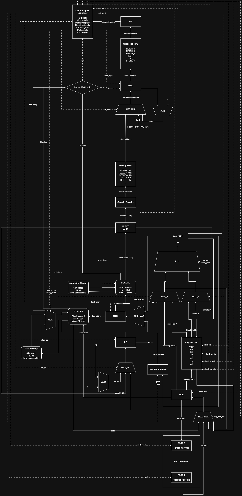
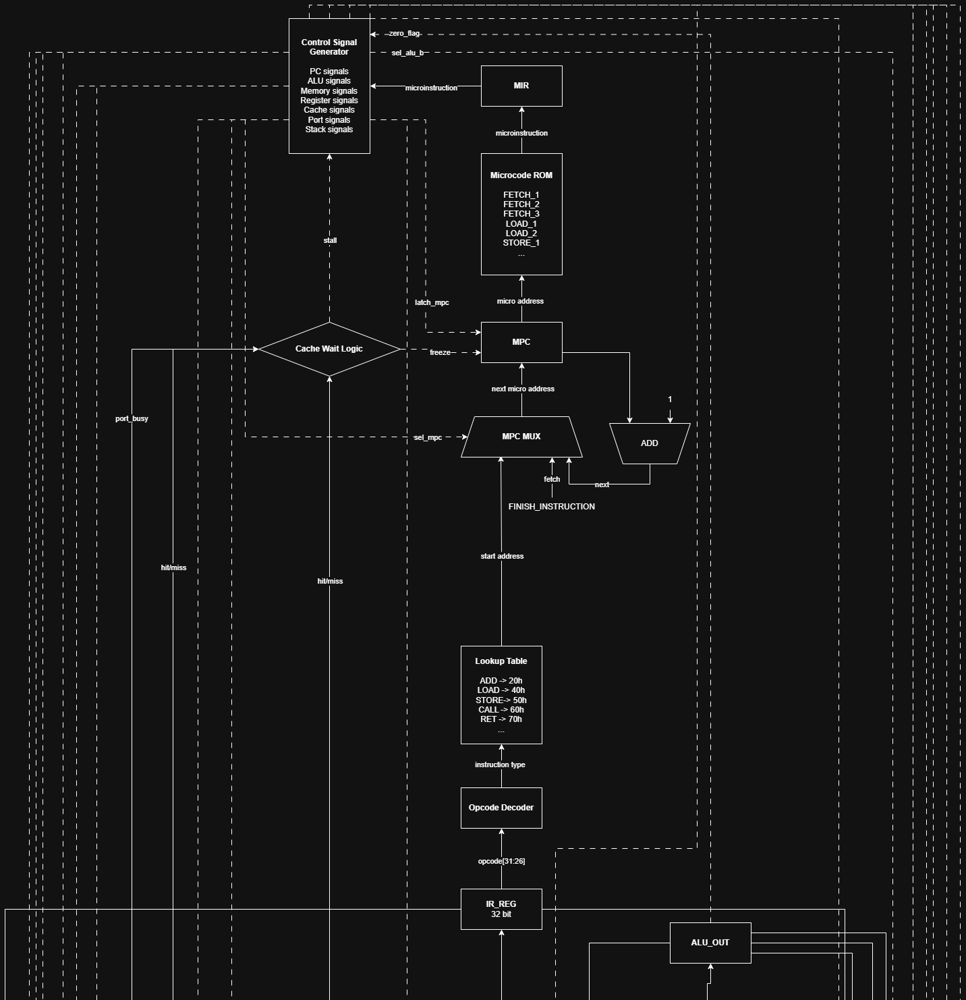
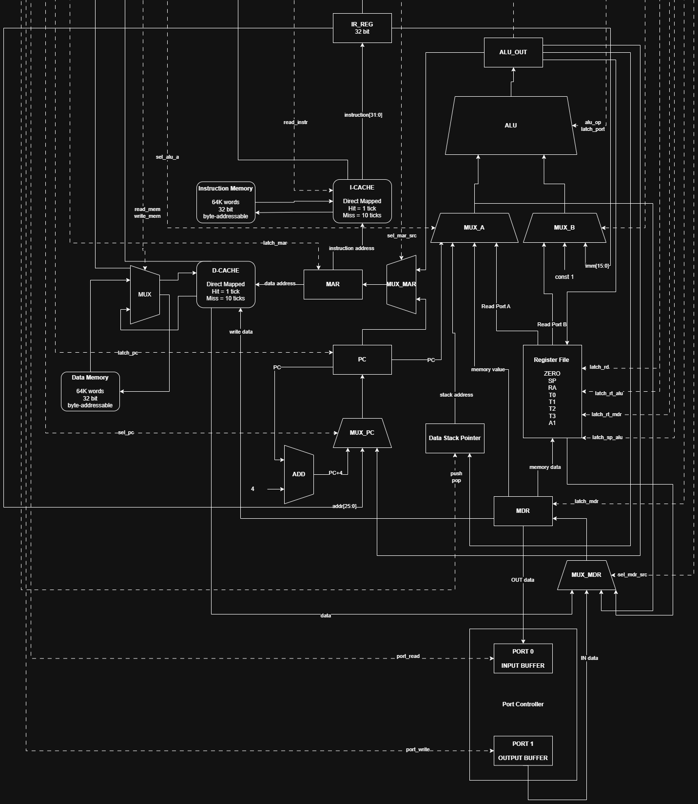

# Лабораторная 4

**Студент:** Мантуш Даниил Валерьевич, группа P3219
**Вариант:** `forth | risc | harv | mc | tick | binary | stream | port | pstr | alg2 | cache`

Проект реализует стековый язык `Forth`, собственную систему команд, микрокомандную модель процессора, транслятор и симулятор.

## Архитектура проекта

Цепочка работы выглядит так:

`Forth-программа` → `translator.py` → `машинный код (.bin + .txt)` → `machine.py` → `журнал работы и вывод`

### Что входит в текущую реализацию

- язык `Forth` с процедурами, переменными, числами, строками и символами;
- execution token: `' word` и `EXECUTE`;
- ветвления `IF/ELSE/THEN`, циклы `BEGIN/WHILE/REPEAT` и `BEGIN/UNTIL`;
- арифметика, логика, сравнения, стековые операции;
- port-mapped I/O (`KEY`, `EMIT`);
- строковый литерал `S"..."` в формате P-string;
- гарвардская память, `I-CACHE`/`D-CACHE`, тактовая модель (`tick`);
- golden-тесты для end-to-end проверки.

## Язык программирования `Forth`

Реализован Forth-подобный стековый язык. Программа читается слева направо, а все данные передаются через стек данных.

### Синтаксис

```ebnf
<программа>              ::= { <строка> }
<строка>                 ::= <определение_слова>
                         | <определение_переменной>
                         | <исполняемый_токен> { <исполняемый_токен> }
                         | <комментарий>
                         | <пустая_строка>

<комментарий>            ::= '\' <любые_символы_до_конца_строки> '\n'
<пустая_строка>          ::= <пробел>* '\n'

<определение_слова>      ::= ':' <имя_слова> { <токен> } ';'
<определение_переменной> ::= ('VARIABLE' | 'CREATE') <имя_переменной> ['ALLOT' <число>]

<токен>                  ::= <число>
                         | <символ_литерал>
                         | <строка_литерал>
                         | <имя_из_словаря_слов>
                         | <управляющая_структура_FORTH>
                         | <любое_другое_слово>

<имя_слова>              ::= <идентификатор>
<имя_переменной>         ::= <идентификатор>
<идентификатор>          ::= ( <буква> | <цифра> | '-' | '_' | '<' | '>' | '@' | '!' | '+' | '*' | '=' | '/' )+

<число>                  ::= [ '-' ] <десятичное_число>
                         | '0x' <шестнадцатеричное_число>
                         | '0b' <двоичное_число>
<десятичное_число>       ::= <цифра>+
<шестнадцатеричное_число>::= ( <цифра> | 'A'..'F' | 'a'..'f' )+
<двоичное_число>         ::= ('0' | '1')+
<цифра>                  ::= '0'..'9'
<буква>                  ::= 'a'..'z' | 'A'..'Z'

<символ_литерал>         ::= '[CHAR]' <любой_символ_без_пробела>
<строка_литерал>         ::= 'S"' <содержимое_строки> '"'
<управляющая_структура_FORTH> ::= 'IF' | 'ELSE' | 'THEN' | 'BEGIN' | 'WHILE' | 'REPEAT' | 'UNTIL'
```

### Семантика

#### Стратегия вычислений

Вычисления выполняются **стековой** стратегией. Все аргументы операций и результаты передаются через **стек данных**. Программа состоит из последовательности **слов** (tokens), которые читаются слева направо. Каждое слово:

- Если это **числовой литерал** -- помещается на вершину стека данных.
- Если это **встроенное слово** (арифметика, стековые операции, I/O) -- извлекает аргументы со стека, выполняет операцию, помещает результат обратно.
- Если это **пользовательское слово** (определённое через `: ... ;`) -- выполняется как подпрограмма: текущий адрес возврата сохраняется на **стеке вызовов**, управление передаётся телу слова, после возврата -- продолжается выполнение.
- Если это **управляющая конструкция** (`IF`, `BEGIN`, `WHILE` и т.п.) -- компилируется в условные/безусловные переходы.

Пример вычисления `2 3 + .`:

```
стек данных: [ ]         → слово "2"  → стек: [2]
стек данных: [2]         → слово "3"  → стек: [2, 3]
стек данных: [2, 3]      → слово "+"  → стек: [5]   (2 + 3 = 5)
стек данных: [5]         → слово "."  → стек: [ ]   (вывод 5)
```

#### Области видимости

Forth использует **словарный** механизм. Все слова хранятся в глобальном словаре. Пользовательские слова, определённые через `: name ... ;`, доступны для вызова из任何 последующего кода. Переменные, созданные через `VARIABLE` или `CREATE ... ALLOT`, также глобальны.

Локальная область видимости отсутствует: все слова и переменные имеют глобальную область видимости с момента определения до конца программы.

#### Типизация и виды литералов

Язык **слабо типизирован** (все значения -- 32-битные целые числа). Поддерживаются следующие виды литералов:

| Литерал | Пример | Описание |
|---------|--------|----------|
| Десятичное число | `42`, `-7` | Целое число в десятичной системе |
| Шестнадцатеричное число | `0xFF`, `0xABC` | Префикс `0x` |
| Двоичное число | `0b1010` | Префикс `0b` |
| Символьный литерал | `[CHAR] A` | Код символа (ASCII) |
| Строковый литерал | `S"hello"` | P-string: длина + байты |
| Execution token | `' word` | Адрес процедуры в памяти команд |

## Организация памяти

Используется **гарвардская архитектура**: память команд и память данных разделены и имеют независимые адресные пространства. Память **однопортовая**: в каждом такте допустима только одна операция (read ИЛИ write).

### Параметры

- **Машинное слово** -- 32 бита (4 байта).
- **Память команд** -- 64K слов (256 КБ), адресное пространство `0x0000..0xFFFF`.
- **Память данных** -- 64K слов (256 КБ), адресное пространство `0x0000..0xFFFF`.
- **Адресация** -- байтовая (один адрес = один байт; машинное слово = 4 байта).

### Регистры, доступные программисту

| Регистр | Номер | Назначение |
|---------|-------|------------|
| `ZERO` | 0 | Константа 0 (аппаратно) |
| `SP` | 1 | Указатель стека вызовов |
| `RA` | 2 | Адрес возврата |
| `T0` | 3 | Временный |
| `T1` | 4 | Временный |
| `T2` | 5 | Временный |
| `T3` | 6 | Временный |
| `A1` | 7 | Аргумент/результат |

Дополнительно в симуляторе используются **внутренние регистры** (недоступны программисту): `PC`, `MAR`, `MDR`, `IR_REG`, `data_sp`, `alu_a`, `alu_b`, `alu_out`, `zero_flag`.

### Раскладка памяти

```text
       Registers
+------------------------------+
| R0 (ZERO)    = 0 (hardwired) |
| R1 (SP)      = call stack    |
| R2 (RA)      = return addr   |
| R3-R6 (T0-T3)= temporaries   |
| R7 (A1)      = arg/result    |
+------------------------------+

       Instruction memory (64K words)
+------------------------------+
| 0x0000 : JMP N (entry stub)  |
|    ...                       |
|    : built-in subroutines    |
|        EMIT, KEY, DUP, ...   |
|    ...                       |
| n   : user program start     |
|    ...                       |
| 0xFFFF                       |
+------------------------------+

          Data memory (64K words)
+------------------------------+
| 0x0000 : variable 1          |
| 0x0001 : variable 2          |
|    ...                       |
| l+0 : string literal 1       |
| l+1 : string literal 1       |
|    ...                       |
| l+N : string literal 2       |
|    ...                       |
|    : free area               |
|    ...                       |
| data_sp → data stack top     |
|    : data stack (↓)          |
|    ...                       |
| SP → call stack top          |
|    : call stack (↓)          |
| 0xFFFF                       |
+------------------------------+
```

### Механика отображения на процессор во время компиляции и исполнения

#### Литералы

**Числовые литералы** компилируются следующим образом:

- Если значение помещается в 16-битный знаковый диапазон (-32768..32767): генерируется одна инструкция `ADDI R_T0, R_ZERO, imm` + `PUSH R_T0`.
- Если значение не помещается: генерируются две инструкции `LUI R_T0, upper16` + `ORI R_T0, R_T0, lower16` + `PUSH R_T0`.

Пример: `42` → `ADDI R3, R0, 42; PUSH R3` (2 инструкции).

**Строковые литералы** (`S"..."`) сохраняются в статическую память данных в формате P-string: первое слово -- длина, затем по одному слову на каждый символ. Во время компиляции генерируется последовательность `LUI` + `ORI` + `PUSH` с плейсхолдерами, которые заполняются при релокации. Строки располагаются в данных последовательно, друг за другом.

**Символьные литералы** (`[CHAR] A`) компилируются как числовые литералы (код символа).

**Execution token** (`' word`) компилируется как числовой литерал -- адрес слова в памяти команд.

#### Константы

Константы в Forth не выделяются отдельно. Значения, заданные литералами, попадают непосредственно в поток инструкций (immediate addressing). Константы не хранятся в памяти данных -- они кодируются в инструкциях.

#### Переменные

Переменные создаются через `VARIABLE name` (1 слово) или `CREATE name ALLOT n` (n слов). Все переменные размещаются в **статической памяти данных**, начиная с адреса `0x0000`.

При обращении к переменной транслятор генерирует `LUI` + `ORI` с адресом переменной + `PUSH`. Переменные **не отображаются на регистры** -- они всегда находятся в памяти. Доступ к ним осуществляется через `@` (чтение: `LOAD`) и `!` (запись: `STORE`).

Если регистров недостаточно для вычислений, промежуточные значения хранятся на стеке данных.

#### Инструкции

Инструкции хранятся в памяти команд начиная с адреса `0x0000`. Первая инструкция -- безусловный переход `JMP` на точку входа (адрес патчится после определения всех слов). Затем следуют встроенные подпрограммы (EMIT, KEY, DUP и др.), затем пользовательский код.

#### Процедуры

Процедуры определяются через `: name ... ;`. При компиляции тело процедуры записывается в память команд. Вызов процедуры (`CALL addr`) сохраняет текущий `PC` на стеке вызовов и выполняет переход. Возврат (`RET`) извлекает адрес со стека вызовов и продолжает выполнение.

Встроенные слова (EMIT, KEY, DUP, SWAP и др.) реализованы как подпрограммы на RISC-инструкциях и вшиты в начало потока команд. Пользовательские слова компилируются аналогично.

#### Прерывания

В данном варианте система прерываний не реализована (вариант `stream`, а не `trap`). Ввод осуществляется через port-mapped I/O: инструкция `IN` читает символ из порта 0, `OUT` записывает символ в порт 1. Модель `stream` останавливает моделирование при исчерпании входного буфера.

### Кеши

Реализованы **direct-mapped** кеши:

| Параметр | Значение |
|----------|----------|
| Тип | Direct-mapped |
| Размер | Настраиваемый (по умолчанию 256 строк) |
| Блок | 1 слово |
| Задержка при hit | 1 такт |
| Задержка при miss | 10 тактов |
| Политика записи | Write-through |

Два независимых кеша: `I-CACHE` (инструкции) и `D-CACHE` (данные).

## Система команд

Процессор использует **RISC** архитектуру с фиксированным 32-битным форматом инструкций. Операции над данными выполняются только в регистрах; доступ к памяти -- через отдельные инструкции `LOAD`/`STORE`.

### Особенности процессора

- **Тип данных**: 32-битные целые числа (знаковые и беззнаковые).
- **Регистры**: 8 общего назначения (R0-R7) + внутренние регистры (PC, MAR, MDR, IR_REG).
- **Память**: гарвардская, 64K слов для команд и 64K слов для данных.
- **Адресация**: словенная, непосредственная (immediate), регистровая, косвенно-регистровая (смещение).
- **Ввод-вывод**: port-mapped, порты 0 (вход) и 1 (выход).
- **Поток управления**: прямой + условные/безусловные переходы + вызовы/возвраты подпрограмм.
- **Прерывания**: не реализованы (модель stream).

### Набор инструкций и такты

Каждая инструкция выполняется за фиксированное число тактов (включая fetch-цикл из 3 микрокоманд).

| Инструкция | Тип | Описание | Тактов |
|------------|-----|----------|--------|
| `NOP` | Sys | Нет операции | 4 |
| `HALT` | Sys | Останов процессора | 4 |
| `ADD Rd, Rs, Rt` | R | Rd = Rs + Rt | 8 |
| `SUB Rd, Rs, Rt` | R | Rd = Rs - Rt | 8 |
| `MUL Rd, Rs, Rt` | R | Rd = Rs * Rt | 8 |
| `DIV Rd, Rs, Rt` | R | Rd = Rs / Rt | 8 |
| `MOD Rd, Rs, Rt` | R | Rd = Rs % Rt | 8 |
| `AND Rd, Rs, Rt` | R | Rd = Rs & Rt | 8 |
| `OR Rd, Rs, Rt` | R | Rd = Rs \| Rt | 8 |
| `XOR Rd, Rs, Rt` | R | Rd = Rs ^ Rt | 8 |
| `CMP Rd, Rs, Rt` | R | Rd = (Rs == Rt ? 1 : 0) | 8 |
| `SHL Rd, Rs, Rt` | R | Rd = Rs << Rt | 8 |
| `SHR Rd, Rs, Rt` | R | Rd = Rs >> Rt (арифм.) | 8 |
| `ADDI Rt, Rs, imm` | I | Rt = Rs + signext(imm) | 8 |
| `ORI Rt, Rs, imm` | I | Rt = Rs \| zeroext(imm) | 8 |
| `LUI Rt, imm` | I | Rt = imm << 16 | 7 |
| `LOAD Rt, imm(Rs)` | I | Rt = Mem[Rs + signext(imm)] | 10 |
| `STORE Rt, imm(Rs)` | I | Mem[Rs + signext(imm)] = Rt | 10 |
| `JZ Rt, imm` | I | if (zero_flag) PC += imm | 6 |
| `JNZ Rt, imm` | I | if (!zero_flag) PC += imm | 6 |
| `IN Rt, port` | I | Rt = порт(port) | 6 |
| `OUT Rs, port` | I | порт(port) = Rs | 6 |
| `PUSH Rs` | S | SP -= 4; Mem[SP] = Rs | 12 |
| `POP Rt` | S | Rt = Mem[SP]; SP += 4 | 12 |
| `JMP addr` | J | PC = addr | 5 |
| `CALL addr` | J | SP -= 4; Mem[SP] = PC; PC = addr | 13 |
| `RET` | J | PC = Mem[SP]; SP += 4 | 15 |

### Кодирование инструкций

Все инструкции -- 32 бита, фиксированная длина. Старшие 6 бит (31..26) -- opcode.

#### R-type (арифметика и логика)

```
 31  26 25  21 20  16 15  11 10        0
+------+-----+-----+-----+------------+
|opcode| rs  | rt  | rd  |   unused   |
| 6    | 5   | 5   | 5   |   11       |
+------+-----+-----+-----+------------+
```

Пример: `ADD R3, R4, R5` → opcode=0x10, rs=4, rt=5, rd=3 → `0x41451800`

#### I-type (с непосредственным значением)

```
 31  26 25  21 20  16 15               0
+------+-----+-----+------------------+
|opcode| rs  | rt  |      imm         |
| 6    | 5   | 5   |      16          |
+------+-----+-----+------------------+
```

- `ADDI`, `LOAD`, `STORE`, `JZ`, `JNZ`: `imm` знаково расширяется до 32 бит.
- `ORI`, `LUI`, `IN`, `OUT`: `imm` беззнаково (zero-extend).

#### J-type (переходы)

```
 31  26 25                                   0
+------+-------------------------------------+
|opcode|             addr                    |
| 6    |             26                      |
+------+-------------------------------------+
```

#### PUSH / POP

```
PUSH:
 31  26 25  21 20                          0
+------+-----+------------------------------+
|opcode| rs  |          unused              |
| 6    | 5   |          21                  |
+------+-----+------------------------------+

POP:
 31  26 25     20  16 15                    0
+------+-----------+------------------------+
|opcode|    rt     |       unused           |
| 6    |    5      |       16               |
+------+-----------+------------------------+
```

#### NOP / HALT / RET (без операндов)

```
 31  26 25                                 0
+------+-----------------------------------+
|opcode|             zeros                 |
| 6    |             26                    |
+------+-----------------------------------+
```

### Управление потоком

- **Безусловные переходы**: `JMP addr` -- прямой переход на абсолютный адрес.
- **Условные переходы**: `JZ` / `JNZ` -- проверяют флаг `zero_flag` и выполняют относительный переход (`PC += imm`).
- **Вызовы подпрограмм**: `CALL addr` -- сохраняет адрес следующей инструкции на стеке вызовов, переходит на `addr`.
- **Возврат**: `RET` -- извлекает адрес со стека вызовов, продолжает выполнение.
- **Циклы** компилируются через `BEGIN` (метка начала), `WHILE` (условие выхода), `REPEAT` (прыжок назад) и `UNTIL` (прыжок назад пока 0).

### Классификация

Процессор классифицируется как:
- **RISC**: фиксированная длина команд (32 бита), операции только над регистрами, отдельные инструкции для доступа к памяти.
- **Stack + Register**: стек данных для передачи аргументов, регистры для внутренних вычислений.
- **Harvard**: разделённые памяти команд и данных.
- **Microcoded**: каждая инструкция выполняется последовательностью микрокоманд.

## Микрокоманды и Control Unit

### Микрооперации

Процессор управляется памятью микропрограмм. Каждая инструкция ISA represented as sequence of MicroOps. Всего 38 типов микроопераций:

| Группа | Микрооперации |
|--------|---------------|
| PC | `LATCH_PC_INC`, `LATCH_PC_ADDR`, `LATCH_PC_ALU` |
| Fetch | `LATCH_MAR_PC`, `INSTR_READ`, `LATCH_IR` |
| ALU input A | `LATCH_A_RS`, `LATCH_A_RT`, `LATCH_A_MDR`, `LATCH_A_SP`, `LATCH_A_PC` |
| ALU input B | `LATCH_B_RT`, `LATCH_B_IMM`, `LATCH_B_CONST_1` |
| ALU output | `LATCH_RD_ALU`, `LATCH_RT_ALU`, `LATCH_RT_MDR`, `LATCH_SP_ALU` |
| ALU ops | `ALU_ADD`, `ALU_SUB`, `ALU_MUL`, `ALU_DIV`, `ALU_MOD`, `ALU_OR`, `ALU_AND`, `ALU_XOR`, `ALU_CMP`, `ALU_SHL`, `ALU_SHR`, `ALU_LUI` |
| Memory/Port | `LATCH_MAR_ALU`, `LATCH_MDR_RT`, `LATCH_MDR_A`, `CACHE_READ`, `CACHE_WRITE`, `PORT_READ`, `PORT_WRITE` |
| Control | `BRANCH_IF_ZERO`, `BRANCH_IF_NOT_ZERO`, `FINISH_INSTRUCTION`, `HALT_PROCESSOR` |

### Fetch-цикл (общий для всех инструкций)

1. `LATCH_MAR_PC` -- MAR = PC (адрес текущей инструкции на шину адреса)
2. `INSTR_READ` -- чтение из I-CACHE по адресу MAR → IR_REG напрямую (может вызвать stall при miss)
3. `LATCH_PC_INC` -- PC += 4 (подготовка к следующей инструкции, байтовая адресация)

После fetch-цикла выполняется микропрограмма конкретной инструкции, завершающаяся `FINISH_INSTRUCTION` (сброс MicroPC в 0).

## АЛУ

АЛУ поддерживает 12 операций:

| Операция | Результат |
|----------|-----------|
| `ADD` | a + b |
| `SUB` | a - b |
| `MUL` | a * b |
| `DIV` | a // b (целочисленное, 0 при b==0) |
| `MOD` | a % b (0 при b==0) |
| `AND` | a & b |
| `OR` | a \| b |
| `XOR` | a ^ b |
| `CMP` | 1 если a == b, иначе 0 |
| `SHL` | a << b |
| `SHR` | a >> b (арифметический сдвиг) |
| `LUI` | b << 16 (загрузка старших 16 бит) |

После каждой операции: `zero_flag = (alu_out == 0)` и `gpr[0] = 0`.

## Модуль условий

Сравнения Forth (`=`, `<>`, `<`, `>`, `<=`, `>=`, `0=`, `0<>`) реализованы через комбинацию инструкций ISA и стековых подпрограмм:

| Forth слово | Реализация |
|-------------|-----------|
| `=` | `CMP` (1 если равны) |
| `<>` | `CMP` + `XOR` с 1 (инверсия) |
| `<` | `SUB` + `SHR` на 31 (извлечение знакового бита) |
| `>` | `SWAP` + вызов `<` |
| `<=` | вызов `>` + вызов `0=` |
| `>=` | вызов `<` + вызов `0=` |
| `0=` | `CMP` с 0 |
| `0<>` | `CMP` с 0 + `XOR` с 1 |

## Ввод-вывод

I/O выполнен через отдельные порты:

- `port 0` -- вход (чтение символа из входного буфера);
- `port 1` -- выход (запись символа в буфер вывода).

`KEY` транслируется в: `IN R_T0, port 0; PUSH R_T0`.
`EMIT` транслируется в: `POP R_T0; OUT R_T0, port 1`.

При исчерпании входного буфера (`stream` модель) моделирование останавливается.

## Транслятор

### Интерфейс командной строки

```bash
python translator.py <source_file.f> <target_file.bin>
```

| Параметр | Описание |
|----------|----------|
| `source_file.f` | Исходный код на Forth |
| `target_file.bin` | Выходной бинарный файл |

### Выходные данные

- `<target_file.bin>` -- бинарный образ (код + данные).
- `<target_file.bin.txt>` -- листинг с мнемониками.

### Принципы работы

Транслятор выполняется в несколько этапов:

1. **Эмиссия entry point**: в адрес 0 записывается `JMP` на точку входа (адрес патчится позже).
2. **Инжекция встроенных подпрограмм**: 18 стандартных слов Forth (EMIT, KEY, +, -, и др.) компилируются как подпрограммы на RISC-инструкциях в начало потока команд. Слова `DUP`, `SWAP`, `DROP`, `OVER`, `ROT` компилируются инлайново (без CALL).
3. **Токенизация**: исходный текст разбивается на токены через `forth_tokenizer.py`.
4. **Обработка токенов**:
   - `:` -- вход в режим определения слова, компиляция тела до `;`.
   - `VARIABLE` / `CREATE` -- выделение памяти в секции данных.
   - Остальные токены -- генерация кода.
5. **Релокация переменных**: адреса переменных в памяти данных патчатся в инструкциях `LUI`+`ORI`.
6. **Релокация строк**: адреса строковых литералов патчатся аналогично.
7. **Запись результата**: бинарный файл `.bin` (код + данные) и листинг `.txt`.

Двоичный образ записывается как big-endian: сначала секция кода (все инструкции до `HALT` включительно), затем секция данных (переменные + строковые литералы).

## Модель процессора

### Интерфейс командной строки

```bash
python machine.py <binary_code_file> <input_file>
```

| Параметр | Описание |
|----------|----------|
| `binary_code_file` | Бинарный файл с машинным кодом |
| `input_file` | Текстовый файл со входными данными |

### Выходные данные

- Вывод данных из процессора (символы, записанные в порт 1).
- Журнал состояний процессора (уровень DEBUG).

### Схемы процессора

Общая схема:



Control Unit:



DataPath:



### Описание регистров и сигналов

#### Регистры DataPath

| Регистр | Ширина | Описание |
|---------|--------|----------|
| `gpr[0..7]` | 32 бита | Регистры общего назначения (R0=ZERO, R1=SP, R2=RA, R3-T0..R6=T3, R7=A1) |
| `PC` | 32 бита | Счётчик команд (byte-address) |
| `MAR` | 32 бита | Регистр адреса памяти |
| `MDR` | 32 бита | Регистр данных памяти |
| `IR_REG` | 32 бита | Регистр инструкции |
| `data_sp` | 32 бита | Указатель стека данных |
| `alu_a`, `alu_b` | 32 бита | Входы АЛУ |
| `alu_out` | 32 бита | Выход АЛУ |
| `zero_flag` | 1 бит | Флаг нулевого результата |

#### Сигналы Control Unit

| Группа | Сигналы |
|--------|---------|
| Шина адреса | `LATCH_MAR_PC`, `LATCH_MAR_ALU` |
| Шина данных | `LATCH_MDR_RT`, `LATCH_MDR_A`, `LATCH_IR` |
| АЛУ input A | `LATCH_A_RS`, `LATCH_A_RT`, `LATCH_A_MDR`, `LATCH_A_SP`, `LATCH_A_PC` |
| АЛУ input B | `LATCH_B_RT`, `LATCH_B_IMM`, `LATCH_B_CONST_1` |
| АЛУ operation | `ALU_ADD`, `ALU_SUB`, `ALU_MUL`, `ALU_DIV`, `ALU_MOD`, `ALU_OR`, `ALU_AND`, `ALU_XOR`, `ALU_CMP`, `ALU_SHL`, `ALU_SHR`, `ALU_LUI` |
| Запись результатов | `LATCH_RD_ALU`, `LATCH_RT_ALU`, `LATCH_RT_MDR`, `LATCH_SP_ALU` |
| Память | `CACHE_READ`, `CACHE_WRITE` |
| I/O | `PORT_READ`, `PORT_WRITE` |
| Управление потоком | `BRANCH_IF_ZERO`, `BRANCH_IF_NOT_ZERO`, `LATCH_PC_INC`, `LATCH_PC_ADDR`, `LATCH_PC_ALU` |
| Завершение | `FINISH_INSTRUCTION`, `HALT_PROCESSOR` |

### Особенности моделирования

1. **Тактовая модель**: каждый вызов `tick()` выполняет одну микрооперацию. Инструкция завершается за фиксированное число тактов (от 4 для NOP до 16 для CALLR).

2. **Кеши**: чтение/запись через direct-mapped кеш. При miss -- stall на 9 тактов (10 тактов总 - 1 текущий).

3. **Стеки**: два независимых стека:
   - **Стек данных** (`data_sp`): начальное значение `MEMORY_SIZE - 20000`, растёт вниз. Используется для PUSH/POP.
   - **Стек вызовов** (`SP`): начальное значение `MEMORY_SIZE - 4000`, растёт вниз. Используется для CALL/RET.

4. **Порты**: port-mapped I/O. Чтение из порта 0 возвращает следующий символ из входного буфера или останавливает симуляцию. Запись в порт 1 добавляет символ в буфер вывода.

5. **Sign extension**: инструкции `ADDI`, `LOAD`, `STORE`, `JZ`, `JNZ` знаково расширяют 16-битный immediate до 32 бит. `ORI`, `LUI`, `IN`, `OUT` -- беззнаково.

## Тестирование

Корректность проверяется интеграционными golden-тестами на базе `pytest` с плагином `pytest-golden`. Каждый golden-тест включает:

- исходный код программы (встроен в YAML);
- входные данные (`in_stdin`);
- конфигурацию (`in_limit`, `in_cache_size`);
- машинный код (base64);
- листинг с мнемониками;
- ожидаемый stdout;
- журнал работы процессора (ограниченный до 500 строк).

### Набор golden-тестов

1. **`hello.yml`** -- вывод `Hello, World!`. Демонстрирует строковые литералы и порт вывода.

2. **`cat.yml`** -- echo-программа, читает ввод и печатает его обратно. Демонстрирует цикл `BEGIN/WHILE/REPEAT` и порт ввода.

3. **`hello_user_name.yml`** -- приветствие по введённому имени:
   ```text
   > What is your name?
   < Alice
   > Hello, Alice!
   ```
   Демонстрирует работу со строками и посимвольный ввод.

4. **`sort.yml`** -- сортировка списка чисел методом пузырька. Пользователь загружает числа через ввод (формат: сначала количество, затем значения). Демонстрирует массивы, парсинг чисел, вложенные циклы.

5. **`double_add.yml`** -- демонстрация 64-битной арифметики на 32-битном процессоре. Реализует сложение 64-битных чисел с переносом. Демонстрирует работу с переменными и арифметику.

6. **`euler6.yml`** -- решение задачи Эйлера №6 (разница между квадратом суммы и суммой квадратов первых 100 натуральных чисел). Алгоритм согласно варианту (`alg2`).

7. **`cache_test.yml`** -- демонстрация влияния кеш-памяти на производительность. Заполняет массив из 64 слов (в 2 раза больше кеша размером 32), дважды считает сумму. Первый проход -- cold cache, второй -- warm cache. Разница в числах тактов подтверждает работу кеша.

### Запуск тестов

```bash
pytest
```

Для перегенерации golden-файлов:

```bash
python gen_golden.py
```

Или через `Makefile`:

```bash
make lint
make typecheck
make test
make coverage
make check
```

### Пример использования инструментальной цепочки

```bash
# 1. Трансляция исходного кода в машинный код
python translator.py examples/hello/hello.f examples/hello/hello.bin

# 2. Запуск симуляции (вход пустой)
python machine.py examples/hello/hello.bin examples/input.txt

# 3. Результат:
#    Successfully translated ... to ...
#    Total instructions: 136, Data size: 56 bytes
#    Simulation output: 'Hello, World!'
#    Total ticks: 2530
```

В репозитории настроен CI (`.github/workflows/ci.yml`): автоматически запускаются `ruff`, `mypy` и `pytest`. Coverage gate: не менее 85%.

## Примеры программ

Примеры исходников и артефактов лежат в `examples/`:

- `hello/` -- Hello World
- `cat/` -- echo ввода
- `hello_user_name/` -- приветствие пользователя
- `sort/` -- сортировка пузырьком
- `double_add/` -- 64-битная арифметика
- `euler6/` -- задача Эйлера №6
- `cache_test/` -- демонстрация кеш-памяти

## Краткий итог

Проект реализует полный учебный стек:

`Forth` → `транслятор` → `машинный код` → `симулятор процессора` → `golden-тесты`.
